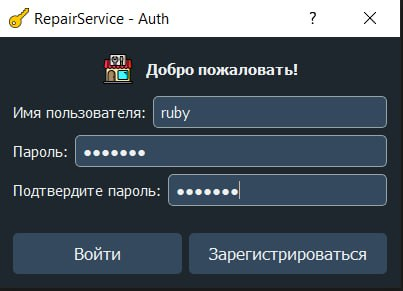
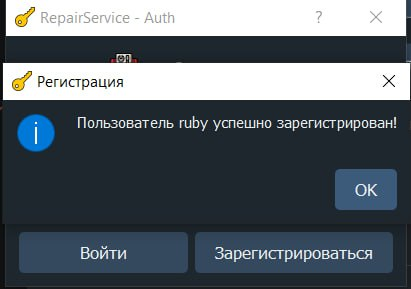

# Repair Service Management App

Repair Service Management App — это приложение на основе PyQt5, предназначенное для управления услугами (например, сантехническими или электрическими), а также для авторизации пользователей.

---

## ▎Функциональность

- **Управление услугами**: добавление услуг в базу данных SQLite (если они отсутствуют), просмотр доступных услуг.
- **Авторизация пользователей**: проверка данных на основе зашифрованных паролей (`bcrypt`) и кэша авторизации.
- **Графический интерфейс**: построен с использованием `PyQt5` и включает в себя авторизационный диалог и основное окно управления.

---

## ▎Технологии

Проект использует следующие библиотеки и технологии:
- **Python 3.x** (основной язык разработки);
- **PyQt5** (для создания пользовательского интерфейса);
- **SQLite** (в качестве базы данных для хранения данных услуг и пользователей);
- **bcrypt** (для защиты данных пользователей через хэширование паролей).

---

## ▎Установка

Перед началом работы убедитесь, что у вас установлен Python 3. Затем выполните следующие шаги:

1. **Клонировать или скачать проект**:
    
bash
    git clone https://github.com/<ваш-репозиторий>
    cd <папка-проекта>
    

2. **Создать виртуальную среду (рекомендуется)**:
    
bash
    python -m venv venv
    source venv/bin/activate    # Для Linux/MacOS
    venv\Scripts\activate       # Для Windows
    

3. **Установить зависимости**:
    
bash
    pip install -r requirements.txt
    

    Если файла `requirements.txt` нет, установите зависимости вручную:
    
bash
    pip install pyqt5 bcrypt
    

---

## ▎Запуск проекта

Для запуска приложения выполните следующую команду:
bash
python main.py

---

## ▎Скриншоты

### Окно авторизации

### Главный экран

---

## ▎Структура проекта

├── app/
│   └── main.py               # Основной файл запуска
│   └── dialogs.py            # Диалоги (например, авторизация)
│   └── windows.py            # Главные окна приложения
│
├── models/
│   └── services.py           # Описание классов услуг
│   └── users.py              # Описание пользователей
│   └── factory.py            # Фабрика для создания объектов
│
├── utils/
│   └── bcryptutils.py       # Функции шифрования (bcrypt)
│   └── authcache.py         # Работа с кэшем авторизации
│
├── static/
│   └── screenshots/          # Скриншоты интерфейса
│
├── requirements.txt          # Список зависимостей
└── README.md                 # Описание проекта

---

## ▎Важные заметки

1. **Подготовка базы данных**:
   - При первом запуске скрипт автоматически создаст базы данных для пользователей (`users.db`) и услуг (`services.db`).
   - Если база данных уже существует — добавление услуг не потребуется.

2. **Безопасность паролей**:
   - Защита паролей обеспечивается библиотекой `bcrypt`. Хеши паролей хранятся в базе данных вместо оригинальных строк.

3. **Обработка авторизации**:
   - Приложение выполняет проверку на авторизационный кеш. Если пользователь уже авторизован, пропускается этап авторизации.

---

## ▎Примечания по работе

### Авторизация:
- В случае успешной авторизации откроется главное окно.
- Если пользователь не авторизован, вы сможете зарегистрироваться (зависит от реализации).

### Услуги:
- Если база данных пуста, по умолчанию добавляются несколько примеров услуг (`PlumbingService`, `ElectricalService`).

---

## ▎Контакты

Если возникли проблемы с запуском или вопросы по работе проекта, пожалуйста, свяжитесь:

- **E-mail:** [example@email.com](mailto:example@email.com)
- **GitHub:** https://github.com/<ваш-репозиторий>
