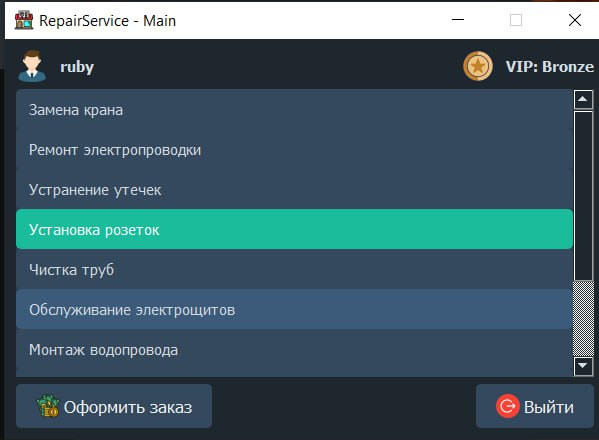

# Repair Service Management App

Repair Service Management App — это приложение на основе PyQt5, предназначенное для бронирования услуг (например, сантехническими или электрическими).
---

## ▎Функциональность

- **Бронирование услуг**: просмотр доступных услуг и бронирование.
- **Авторизация пользователей**: проверка данных на основе зашифрованных паролей (`bcrypt`) и кэша авторизации.
- **Графический интерфейс**: построен с использованием `PyQt5` и включает в себя авторизационный диалог и основное окно управления.

---

## ▎Технологии

Проект использует следующие библиотеки и технологии:
- **Python 3.x** (основной язык разработки);
- **PyQt5** (для создания пользовательского интерфейса);
- **SQLite** (в качестве базы данных для хранения данных услуг и пользователей);
- **bcrypt** (для защиты данных пользователей через хэширование паролей).

---

## ▎Установка

Перед началом работы убедитесь, что у вас установлен Python 3. Затем выполните следующие шаги:

1. **Клонировать или скачать проект**:
    
```bash
git clone https://github.com/yourmind646/repair-service-app
cd repair-service-app
```    

2. **Создать виртуальную среду (рекомендуется)**:
    
```bash
python -m venv venv
source venv/bin/activate    # Для Linux/MacOS
venv\Scripts\activate       # Для Windows
```

3. **Установить зависимости**:
```bash
pip install pyqt5 bcrypt
```

---

## ▎Запуск проекта

Для запуска приложения выполните следующую команду:
```bash
python main.py
```
---

## ▎Скриншоты

### Окно авторизации


### Главный экран


---
